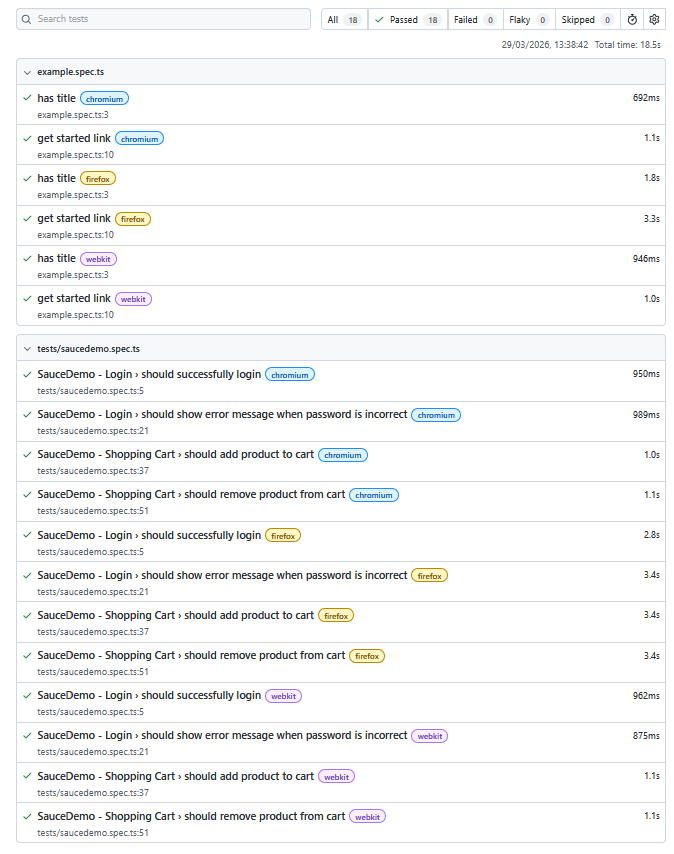

# Automated Tests - SauceDemo


E2E test automation project for [SauceDemo](https://www.saucedemo.com/) using Playwright and TypeScript.

## What's included

**Login:**
- Login with valid credentials
- Error message validation when password is incorrect

**Shopping Cart:**
- Add product to cart
- Remove product from cart

## Test results




## How to run

Install dependencies:
```bash
npm install
```

Run the tests:
```bash
npx playwright test
```

Run with visual interface:
```bash
npx playwright test --ui
```

View the report:
```bash
npx playwright show-report
```

## Stack

- Playwright
- TypeScript
- GitHub Actions

---

Project developed during QA studies.